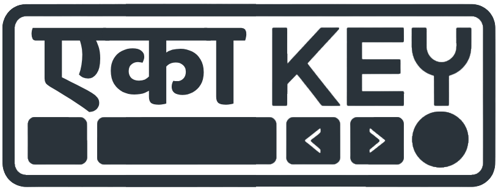
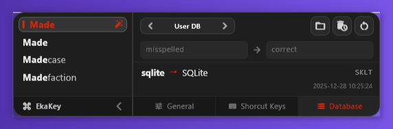
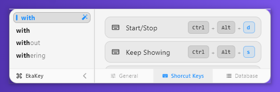
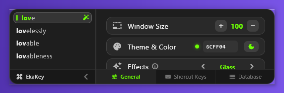
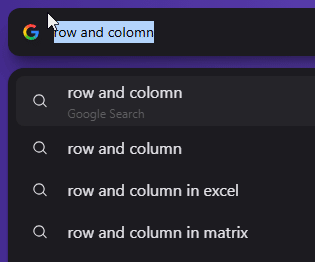
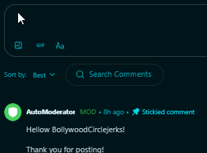
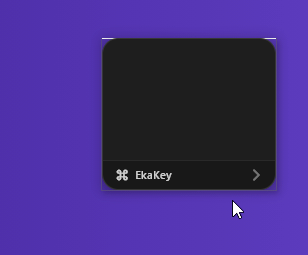

<div align="left">

  

  **A globally working autoCorrect for Windows PC**
  
  It's a system-wide, floating typing assistant built with **Flutter** and **Win32 C++ Hooks**. It brings mobile-style autocorrect for PC, uses **autoTrie** to learn and suggest words that are personalized to you, and visual typing effects to *any* application on Windows (Notepad, Discord, Browser, IDEs, etc.).


  
  

</div>

<br>


## ✨ How things work ?

*   **Low Level listening:** Listen(doesn't intercept) keystrokes globally using low-level Win32 C++ hooks 
*   **Phonetics Integration:** Correct words based on how they sound using Double Metaphone phonetics by [*dart_phonetics*](https://pub.dev/packages/dart_phonetics)
*   **Predictive Engine:** Suggests words via a Trie Engine by [*autotrie*](https://pub.dev/packages/autotrie)
*   **Learning in a sec:** Remembers your corrections—undo a correction once, and it learns your preference, and never correct that again
*   **SQLite for Database:** Stores learnings in a SQL Table  
* **Key Simulator:** Does backspaces and type corrected word by *SendInput Windows API*
*   **Low-to-No Lag:** Uses native windows Hooks and API for System-wide tasks so that your system don't feel load 

<br>

## 🎨 UI visuals 
<div align="center">
  
  <br>
  
  <br>
  
</div>


## 🎮 Controls

| Hotkey | Action |
| :--- | :--- |
| **Ctrl + Alt + D** | Start / Stop Ekakey |
| **Ctrl + Alt + S** | Toggle "Keep Showing" (Prevents auto-hide) |
| **Shift + Tab** | Cycle through suggestion tiles |

**⚠ Note:** The bottom two hotkeys require EkaKey to be running; if it is in a stop state via Ctrl+Alt+D, those shortcuts will not work until EkaKey is started again.

## 📖 How to Use
<table> <tr> <td width="40%"></td> <td width="60%"> <h3>Basic Auto-Correct</h3> <p>As the app starts, EkaKey will autoCorrect words on the way. Press <kbd>Ctrl</kbd>+<kbd>Alt</kbd>+<kbd>D</kbd></b> to toggle the engine on/off. </p> </td> </tr>

<tr> <td width="40%"></td> <td width="60%"> <h3>Undo an Auto-Correct</h3> <p>Wrong auto-correct? Just hit <kbd>Backspace</kbd> once, to get your original word back. Plus, once you do this, EkaKey stops autocorrecting 'Rizzler' in the future.</p> </td> </tr>

<tr> <td width="40%"></td> <td width="60%"> <h3>Make your own abbreviation</h3>
 <p><code>hlo → hello</code> <code>ur → your</code><br>
 After you type a word <mark>and press <kbd>Space</kbd> then</mark>, EkaKey watches for a <kbd>Backspace</kbd>. If you hit it, you are in editing mode. Once you press <kbd>Space</kbd> again to finish, EkaKey learns that correction and saves the pair <code>lastIncorrectWord → correctWord</code> to user database.</p> </td> </tr>

<tr> <td width="40%"></td> <td width="60%"> <h3>To delete from your database</h3> <p>User personalized words are stored in a SQL Database which you can access in EkaKey sidepannel. Here all your personal/nonAutoCorrectable words exists. You can delete them one-by-one or all words older than x days.</p> </td> </tr>

<tr> <td width="40%"></td> <td width="60%"> <h3>To Backspace without editing</h3> <p>You may wanna backspace without EkaKey saving a new database entry, use <kbd>Ctrl</kbd> + <kbd>Backspace</kbd>. Using this shortcut (or other <label title="Ctrl, Alt, Win, Delete, ArrowKeys, Period, Comma, 0-9&#10;and all other symbols except single/double Quote and&#10;Hyphen/Underscore" style="color: blue;">cancellation keys</label>) will exit editing mode and bypass the saving process.</p> </td> </tr>

<tr> <td width="40%"></td> <td width="60%"> <h3>Snap to the corner</h3> <p>Use the hotkkey <kbd>Ctrl</kbd>+<kbd>Alt</kbd>+<kbd>S</kbd> to keep the window visible, and then grab the status bar to drag and slam it to the corner of the screen. I'll align itself.</p> </td> </tr> </table>


## 🛡️Privacy
I recommend disabling EkaKey with <kbd>Ctrl</kbd>+<kbd>Alt</kbd>+<kbd>D</kbd> when entering passwords or sensitive login IDs. Though the app will not save any data to the database unless you get into Edit Mode, turning it off provides an extra layer of privacy because when turned off the C++ HOOK is detached and stops Listening to keystrokes.

Database Location: <code>C:\Users\UserName\AppData\Roaming\com.example\ekakey</code>

## 🛠️ Installation & Build

### Prerequisites
*   [Flutter SDK](https://flutter.dev/docs/get-started/install/windows) installed.

### Running from Source

1.  **Clone the repository:**
    ```bash
    git clone https://github.com/your-username/ekakey.git
    cd ekakey
    ```

2.  **Install dependencies:**
    ```bash
    flutter pub get
    ```

3.  **Run in Debug mode:**
    ```bash
    flutter run -d windows
    ```

4.  **Build Release Version:**
    ```bash
    flutter build windows
    ```
    The executable will be located in: `build/windows/runner/Release/`

## 🏗️ Architecture


*   **Frontend:** Flutter (UI, Animations, Settings).
*   **Backend Logic:** Dart (Trie Engine, SQLite Database management).
*   **Native Interop:** C++ (`win32` package) for keyboard hooking and simulating keystrokes (`SendInput`).

## 🤝 Contributing

Contributions are welcome! If you have ideas for new visual effects or better prediction algorithms, feel free to open an issue or submit a pull request.

## 📄 License

This project is licensed under the MIT License - see the `LICENSE` file for details.
